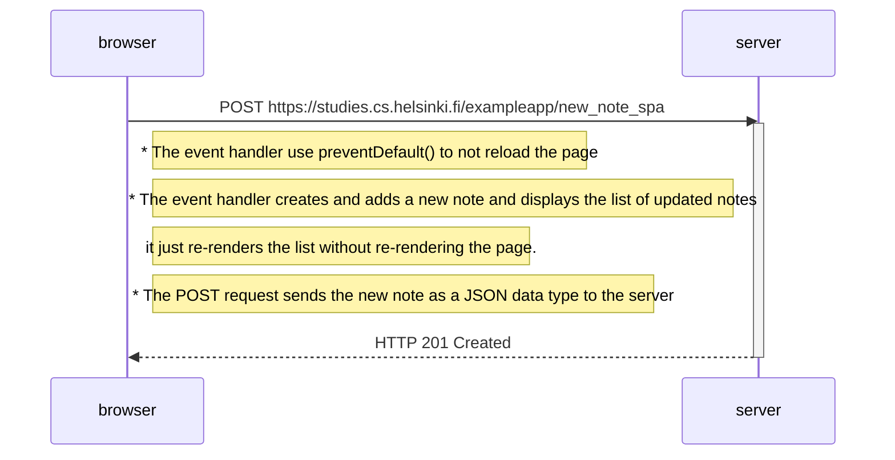

```mermaid
sequenceDiagram
    participant browser
    participant server

    browser->>server: POST https://studies.cs.helsinki.fi/exampleapp/new_note_spa
    activate server
    Note right of browser: * The event handler use preventDefault() to not reload the page
    Note right of browser: * The event handler creates and adds a new note and displays the list of updated notes
    Note right of browser:  it just re-renders the list without re-rendering the page.
    Note right of browser: * The POST request sends the new note as a JSON data type to the server

    server-->>browser: HTTP 201 Created
    deactivate server

   
```
